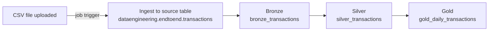

# 🏗️ End-to-End Data Engineering Project in Databricks

An automated **medallion pipeline** (Bronze → Silver → Gold) built with **Delta Live Tables and PySpark** that turns raw retail transaction data into clean, analytics-ready daily metrics. A Databricks job triggers whenever a new CSV file is added, so ingestion and processing run end to end with no manual steps.

<!-- Add a pipeline graph screenshot here once uploaded:

-->

---

## 🧾 Executive Summary (For Hiring Managers)

- ✅ **Pipeline scope:** Built a complete **Bronze/Silver/Gold medallion pipeline** in Databricks, from raw transactions to a daily business summary
- ✅ **Data quality:** Enforced **six `expect_or_drop` expectations** in the Silver layer so invalid records never reach analytics
- ✅ **Automation:** A **Databricks job with a trigger** ingests each new CSV upload and runs the pipeline automatically
- ✅ **Governance & performance:** Reads from a **Unity Catalog** table and clusters the Gold table by `transaction_date`

---

## 🧩 Problem & Context

Retail transaction data arrives as raw files that are not ready for analysis. The text fields are inconsistent (mixed casing, padded spaces, repeated whitespace), and records with missing IDs or non-positive quantities and amounts would distort revenue metrics if they slipped through.

Analysts need to answer questions like:

- How many transactions and how much revenue did we make each day?
- How many unique customers and products were involved?

**Solution:** A layered pipeline where each layer has one job:

| Layer | Table | Purpose |
|---|---|---|
| 🥉 Bronze | `bronze_transactions` | Raw ingestion from the source table, plus an `ingestion_timestamp` for lineage |
| 🥈 Silver | `silver_transactions` | Validated and standardized transactions |
| 🥇 Gold | `gold_daily_transactions` | Daily summary metrics for reporting |

---

## 🧰 Tech Stack

- 🧱 **Platform:** Databricks
- 🔄 **Pipeline framework:** Delta Live Tables (declarative pipelines using the `pyspark.pipelines` API)
- 🐍 **Language:** Python / PySpark
- 🗂️ **Governance:** Unity Catalog (`dataengineering.endtoend.transactions` as the source table)
- ⏱️ **Orchestration:** Databricks Jobs with a trigger on new CSV uploads
- 📦 **Version Control:** Git/GitHub

---

## 🏗️ Pipeline Architecture

### 🥉 Bronze: Raw Ingestion

- Reads the source table and adds an `ingestion_timestamp` column using `current_timestamp()`
- Keeps the data exactly as received, so the raw layer stays a faithful record of what arrived

### 🥈 Silver: Clean & Validate

- Applies **six data quality expectations** (see below); rows that fail any rule are dropped
- Standardizes text fields:
  - `trim` on `transaction_id`, `customer_id`, `product_id`, `store_location`
  - `lower` + `trim` on `category` and `payment_method`
  - `lower` + `trim` + regex whitespace normalization on `product_name`
- Adds `transaction_date_only` (formatted `yyyy-MM-dd`) for easy daily grouping

### 🥇 Gold: Daily Business Summary

- Aggregates Silver by day: transaction count, total revenue (rounded to 2 decimals), total quantity, unique customers, and unique products
- Clustered by `transaction_date` to speed up date-based queries

---

## ✅ Data Quality

| Expectation | Rule | Action |
|---|---|---|
| `valid_transaction_id` | `transaction_id` is not null and not blank | Drop row |
| `valid_transaction_date` | `transaction_date` is not null | Drop row |
| `valid_quantity` | `quantity > 0` | Drop row |
| `valid_unit_price` | `unit_price > 0` | Drop row |
| `valid_total_amount` | `total_amount > 0` | Drop row |
| `valid_customer_id` | `customer_id` is not null and not blank | Drop row |

Delta Live Tables records how many rows each expectation dropped in the pipeline event log, so data quality can be monitored over time.

**Effect of the Silver cleaning step on real rows:**

| Column | Bronze (raw) | Silver (cleaned) |
|---|---|---|
| `product_name` | `WATER BOTTLE` (padded with spaces) | `water bottle` |
| `product_name` | `yoga  mat` (double space) | `yoga mat` |
| `product_name` | `BACKPACK` | `backpack` |
| `category` | `Apparel` | `apparel` |
| `payment_method` | `Credit Card` | `credit card` |
| `transaction_date_only` | *(not present)* | `2025-01-25` |

---

## ⚙️ Orchestration

A **Databricks job** ties the whole flow together. When a new CSV file is added, the trigger fires, the file is ingested into the source table, and the pipeline runs through Bronze, Silver, and Gold. No manual runs are needed.

<!-- Add a job screenshot here once uploaded:

-->

---

## 📊 Sample Output

`gold_daily_transactions` (sample rows):

| transaction_date | transaction_count | total_revenue | total_quantity | unique_customers | unique_products |
|---|---|---|---|---|---|
| 2025-01-07 | 7 | 380.14 | 18 | 7 | 6 |
| 2025-01-08 | 4 | 176.63 | 13 | 4 | 3 |
| 2025-01-09 | 5 | 440.89 | 15 | 5 | 5 |
| 2025-01-10 | 6 | 868.05 | 23 | 6 | 6 |

---

## 💻 Data Engineering Skills Demonstrated

### Pipeline Development

- **Medallion architecture:** Separate Bronze, Silver, and Gold layers with clear responsibilities
- **Delta Live Tables:** Declarative pipeline definitions using materialized views
- **Lineage:** `ingestion_timestamp` added at the Bronze layer
- **Aggregation:** `groupBy` with `count`, `sum`, and `countDistinct` for daily metrics

### Data Quality & Cleaning

- **Expectations:** `@dp.expect_or_drop` rules for null/blank IDs, missing dates, and non-positive numbers
- **Standardization:** `trim`, `lower`, and `regexp_replace` for consistent text fields
- **Derived columns:** `date_format` and `to_date` for date handling

### Platform & Automation

- **Unity Catalog:** Reading from a governed catalog table
- **Jobs & triggers:** Event-driven runs on new CSV uploads
- **Performance:** `cluster_by` on the Gold table

---

## 🚀 How to Run

1. Load the CSV file into the Unity Catalog table `dataengineering.endtoend.transactions`
2. Create a Delta Live Tables pipeline in Databricks and add the Bronze, Silver, and Gold source files
3. Run the pipeline and inspect `gold_daily_transactions`
4. (Optional) Create a Databricks job with a trigger on new file uploads to automate steps 1 and 3

---

## 🔭 Possible Improvements

- Route invalid rows to a **quarantine table** instead of dropping them, so they can be reviewed
- Add **deduplication** on `transaction_id`
- Add Gold aggregates by category, store location, and payment method
- Build a dashboard on top of `gold_daily_transactions`

---

## 🙏 Acknowledgements

Built while learning from Alex The Analyst's Databricks courses (*Databricks for Beginners* and *Data Engineering in Databricks*).
